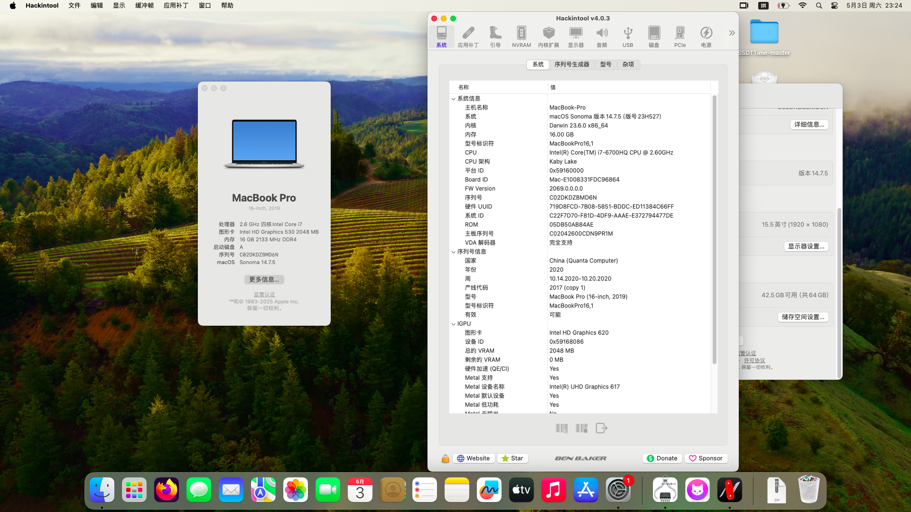

# HP-OMEN-15-ax103tx-i7-6700HQ-hackintosh
应用于HP OMEN 15-ax103tx(X9J87PA/TPN-Q173) 的OpenCore 1.0.4的黑苹果引导 支持macOS Sequoia 15.4.1

注意：
- 此EFI不含三码 实际使用时请自行使用[OCAT](https://github.com/ic005k/OCAuxiliaryTools)生成
- 从macOS Sequoia开始，Intel Wi-Fi网卡需要使用[OCLP-Mod](https://github.com/laobamac/OCLP-Mod/releases)打补丁才可使用。


### 配置清单
|类型|型号|规格|
|---|---|---|
|CPU|Intel Core i7-6700HQ|2.60 GHz|
|内存1|Micron 8ATF1G64HZ-2G6E1|2400 MHz|
|内存2|Samsung M471A1K43BB0-CPB|2133 MHz|
|SSD|SanDisk SD8SNAT-128G-1006|128 GB|
|HDD|HGST HTS721010A9E630|1 TB|
|iGPU|Intel HD Graphics 530|2048 MB|
|dGPU|AMD Radeon RX 460|4096 MB|
|网卡|RealTek RTL8168|1000 Mbps|
|Wi-Fi|Intel Wi-Fi AC-7265|867 Mbps|
|声卡|RealTek ALC295|立体声|
|操作系统|macOS Monterey-Sequoia|12.0-15.4.1|
|BIOS|InsydeH20 UEFI|F.14|

#### 无法工作的部分
- 隔空投送和接力：需要破解BIOS网卡白名单，更换博通WI-FI网卡，并使用OCLP-Mod打补丁。
- 独立显卡：暂时无解
- HDMI接口：暂时无解
- DRM硬解：无解
- iPhone 镜像：无解

#### 附注事项
- 睡眠未测试，如果出现睡死或唤醒闪屏问题，可使用终端强制关闭睡眠功能：
```
sudo pmset -a sleep 0
sudo pmset -a hibernatemode 0
sudo pmset -a disablesleep 1
```